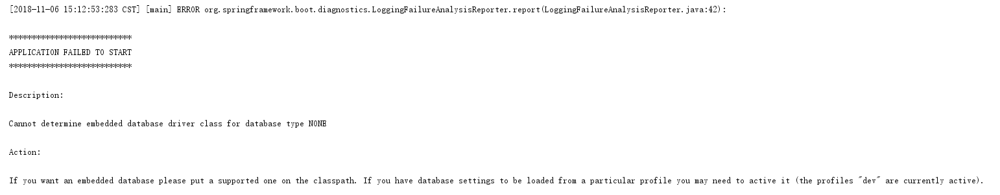

## java 笔记

### java语言
#### 集合
for、增强for循环遍历中不能删除元素
解决方案： 使用迭代器删除

**collection 转 ArrayList等子类：**
错误：(List)collection  异常
正确：使用构造器：new ArrayList(collection)

### spring
#### spring依赖注入 一个接口多个实现
1. @Autowired + @Qualifier("component1")
2. @Resource(name="component1")
3. @Autowired list形式注入
        @Autowired
        List<Component> components

#### springboot命令行以不同分支启动
    java -jar x.jar --spring.profiles.active=xxx

#### springboot启动忽略数据源的配置
在springboot项目中如果不配置数据源的话会报以下的错误:

解决方案:
1、pom删除所有的数据源依赖
2、@EnableAutoConfiguration(exclude={DataSourceAutoConfiguration.class})启动类排除数据源检查

#### feign调用RequestMapping不能被继承

```
父接口：
public interface BaseClient {
    @RequestMapping(value = "/save", method = RequestMethod.POST)
    String query(@RequestBody User user); 
}
子接口
@FeignClient(name = "${service.name}", url="${service.url}")
@RequestMapping("/user")
public interface UserClient extends BaseClient{
}
```
这样的情况使用/user/save，是失败的
解决方案：使用 FeignClient的path
```
@FeignClient(name = "${service.name}", url="${service.url}", path="/user")
public interface UserClient extends BaseClient{
}
```

#### spring aop
spring对类内部调用的方法调用是aop不起作用
```
class A {
    public void t1() {
        // 如果对class A进行代理，只有方法t1能被代理，t2不行
        t2();
    }
    public void t2() {}
}
```

### mybatis
####  resultMap与 resultType
resultType:
可以是java自带的类型，如：string、integer、map等，list也需要配置成map。但是在自定义的类型时，需要数据库查询的结果集合一样。否则不能自动注入。
resultMap:
可以由自定的数据映射规则，例：
```
<resultMap id="user" type="com.xxx.user">
// id映射主键信息
<id column="id" property="id" />
<result column="u_name" property="name" />
<result column="u_age" property="age" />
</resultMap>
```
####插入 返回自增id
sql的xml文件上：useGeneratedKeys="true" keyProperty="id" (java bean 对应的字段)

### dubbo
dubbo注册当中，url参数指的是不从zk上拉取服务，从指定的url地址直连
```
// check 启动时是否对bean进行检查，true：进行检查如果bean未初始化，启动失败
<dubbo:reference id="xx" url="" interface="com.aa.bb" check="false" />
```