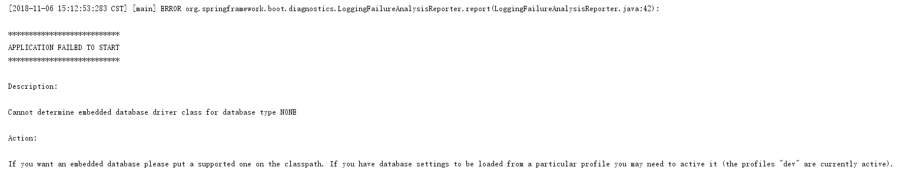

## spring 笔记

#### spring依赖注入 一个接口多个实现
1. @Autowired + @Qualifier("component1")
2. @Resource(name="component1")
3. @Autowired list形式注入
        @Autowired
        List<Component> components

#### springboot命令行以不同分支启动
    java -jar x.jar --spring.profiles.active=xxx

#### springboot启动忽略数据源的配置
在springboot项目中如果不配置数据源的话会报以下的错误:

解决方案:
1、pom删除所有的数据源依赖
2、@EnableAutoConfiguration(exclude={DataSourceAutoConfiguration.class})启动类排除数据源检查

#### feign调用RequestMapping不能被继承

```
父接口：
public interface BaseClient {
    @RequestMapping(value = "/save", method = RequestMethod.POST)
    String query(@RequestBody User user); 
}
子接口
@FeignClient(name = "${service.name}", url="${service.url}")
@RequestMapping("/user")
public interface UserClient extends BaseClient{
}
```
这样的情况使用/user/save，是失败的
解决方案：使用 FeignClient的path
```
@FeignClient(name = "${service.name}", url="${service.url}", path="/user")
public interface UserClient extends BaseClient{
}
```